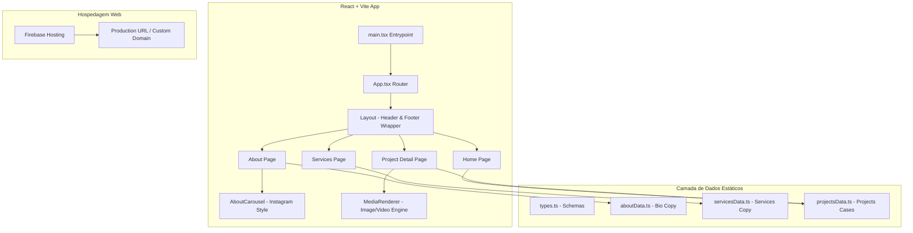

# Documento de Arquitetura Master Global
## Portfólio Ingrid Sinkovitz — Versão 10.0 (Nova Arquitetura Editorial)

Este documento representa a **Única Fonte de Verdade (Single Source of Truth)** para a arquitetura, pilha tecnológica e fluxos de dados do novo site após a refatoração completa baseada no modelo editorial de Luana Floriani.

---

## 1. Visão Geral e OKRs do Portfólio
O Portfólio da Ingrid Sinkovitz foi totalmente remodelado com uma abordagem minimalista de alto impacto visual e apelo editorial ("high-end branding"). A navegação em 2D baseada em canvas de grafos (versão anterior) foi substituída por um fluxo clássico de páginas leves, responsivas e voltadas para o storytelling profissional de Marketing e Gestão de Projetos.

* **Objetivo Principal (OKR):** Apresentar a Ingrid como uma autoridade estratégica em storytelling, neurociência, comportamento humano e construção de comunidades, com um portfólio limpo que carrega de forma instantânea em dispositivos móveis e desktop.
* **Estética Visual:** Baseada em um fundo marfim suave (`#FEFCF5`), tipografia serifada clássica (*Cormorant Garamond*) e sans-serif geométrica de leitura (*Outfit*), com botões e destaques na cor azul royal (`#3D54C8`).

---

## 2. Pilha Tecnológica (Stack) e Dependências
* **Framework & Compilador:** React 19 (Interface) e Vite 6 (Build Tool de ultra performance).
* **Estilização e Design System:** Tailwind CSS v4 (Styling) com extensões de temas personalizadas diretamente no CSS.
* **Roteamento:** React Router v7 (`react-router-dom`).
* **Ícones:** Lucide React.
* **Infraestrutura & Deploy:** Firebase v12 (Firebase Hosting para hospedagem estática rápida, regras de segurança do Firestore/Storage preservadas para integrações futuras).

---

## 3. Diagrama de Arquitetura de Componentes



---

## 4. Estrutura de Diretórios
Os arquivos ativos do projeto estão organizados da seguinte forma:

```text
site-ingrid-sinkovitz/
├── .firebase/                  # Cache local de deploy
├── .github/workflows/          # Integração contínua (Merge/PR)
├── public/                     # Arquivos públicos e estáticos
│   ├── fotos/                  # Banco de imagens da Ingrid
│   │   └── CARROSEL CURIOSIDADES SOBRE MIM/  # As 15 imagens do carrossel
│   ├── logos/                  # Logotipos (SVG e PNG)
│   ├── BRIEFING REBRANDING.pdf # Documento de requisitos enviado pelo usuário
│   └── CNAME                   # Configuração de domínio (www.ingridsinkovitz.com.br)
├── src/                        # Código-fonte principal
│   ├── components/             # Componentes reutilizáveis (Layout, AboutCarousel, MediaRenderer)
│   ├── data/                   # Constantes de dados estáticos (aboutData, servicesData, projectsData)
│   ├── pages/                  # Páginas principais (Home, About, Services, ProjectDetail)
│   ├── App.tsx                 # Rotas e configurações do app
│   ├── index.css               # Estilos globais e importação de fontes do Google
│   ├── main.tsx                # Ponto de inicialização do React
│   └── types.ts                # Definições de interfaces do TypeScript
├── firebase.json               # Configurações do Firebase
├── firestore.rules             # Regras de segurança do banco de dados (Preservadas)
├── storage.rules               # Regras de segurança de arquivos (Preservadas)
├── tsconfig.json               # Configurações do compilador TypeScript
└── vite.config.ts              # Configurações de build do Vite (Tailwind, React e proxy)
```

---

## 5. Componentes-Chave e Lógicas Customizadas

1. **`AboutCarousel.tsx` (Carrossel estilo Instagram):**
   * **Navegação Inteligente:** Botões laterais de seta translúcidos (`backdrop-blur`).
   * **Bolinhas Dinâmicas:** Exibe as bolinhas do rodapé de forma responsiva. Quando há muitos itens (15 fotos), as bolinhas que estão a mais de 3 passos do slide ativo diminuem de tamanho (`scale-75`, `scale-50`) ou são ocultadas para manter a barra limpa e evitar quebras de layout.
   * **Suporte Mobile:** Eventos `onTouchStart`, `onTouchMove` e `onTouchEnd` integrados para reconhecer gestos de deslizar (swipe) em dispositivos móveis.
2. **`MediaRenderer.tsx` (Renderizador Genérico):**
   * Detecta se a URL fornecida é de imagem ou vídeo e renderiza a tag apropriada com tratamento visual de esqueleto de carregamento (`animate-pulse`) enquanto o recurso é baixado.
3. **`index.css` (Temas Tailwind v4):**
   * Utiliza a nova especificação `@theme` do Tailwind CSS v4 para definir as fontes `--font-serif` (*Cormorant Garamond*), `--font-sans` (*Outfit*) e cores de marca (`--color-brand-cream`, `--color-brand-charcoal`, `--color-brand-blue`).

---
*Assinado: Agente Lincoln & Artz — Julho de 2026.*
